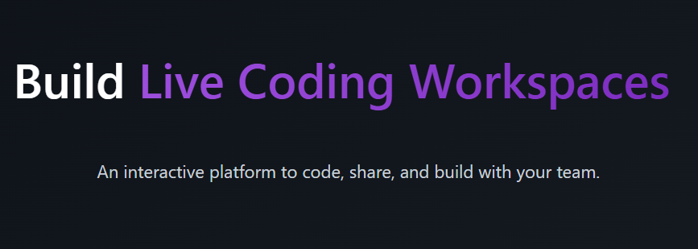
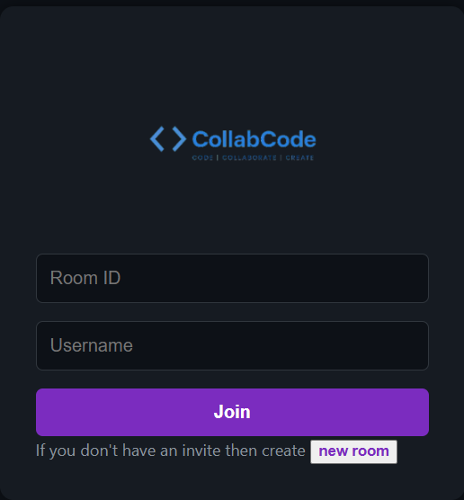
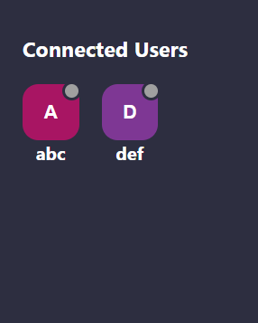
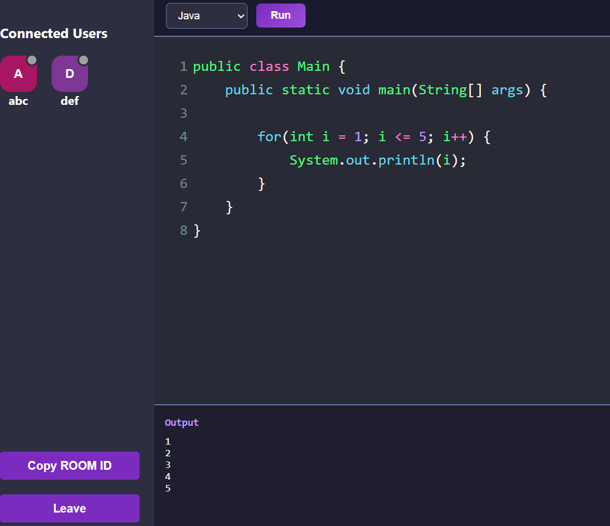

# ⚡ CollabCode — Realtime Code Editor

> **Code | Collaborate | Create**

A collaborative, real-time code editor that allows multiple users to write and execute code together in the same room — simultaneously.


---

## 📸 Screenshots

### 🏠 Home Page


### 🔐 Join Room


### 👥 Connected Users


### 💻 Live Code Execution


---

## 🚀 Features

- 👥 **Real-time Collaboration** — Multiple users can code together in the same room simultaneously
- 💻 **Multi-language Support** — Java, Python, JavaScript
- ▶️ **Live Code Execution** — Run code and see output instantly
- 🔗 **Room System** — Create or join rooms with a unique Room ID
- 📋 **Copy Room ID** — Share room with anyone instantly
- 🎨 **Dracula Theme** — Beautiful dark theme, easy on the eyes
- 👤 **User Avatars** — See who's connected in real-time

---

## 🛠️ Tech Stack

| Layer | Technology |
|-------|-----------|
| Frontend | React, CodeMirror |
| Backend | Node.js, Express |
| Realtime | Socket.io |
| Code Execution | Child Process (exec) |
| Styling | CSS3 |

---

## 📦 Installation & Setup

### Prerequisites
- Node.js installed
- Java (JDK) installed
- Python installed

### Steps

```bash
# 1. Clone the repo
git clone https://github.com/harkirankalra/realtime-code-editor.git
cd realtime-code-editor

# 2. Install dependencies
npm install

# 3. Start backend server (Terminal 1)
node server.js

# 4. Start frontend (Terminal 2)
npm start
```

Open [http://localhost:3000](http://localhost:3000) in your browser.

---

## 🎮 How to Use

1. Enter your **username** on the home page
2. **Create** a new room or **join** an existing one with a Room ID
3. Share the **Room ID** with your friends
4. Start coding **together in real-time**!
5. Select language (Java / Python / JavaScript) and click **Run**
6. See the output instantly in the **Output box** below

---

## 📁 Project Structure

```
realtime-code-editor/
├── src/
│   ├── components/
│   │   ├── Editor.js       # CodeMirror editor
│   │   └── Client.js       # Connected user avatar
│   ├── pages/
│   │   ├── Home.js         # Landing page
│   │   └── EditorPage.js   # Main editor page
│   └── Actions.js          # Socket event constants
├── server.js               # Express + Socket.io backend
├── docker/                 # Docker configs for code execution
└── README.md
```

---

## 🔮 Future Improvements

- [ ] Responsive design for mobile
- [ ] User input support (Scanner in Java, input() in Python)
- [ ] Save code after page refresh (MongoDB)
- [ ] In-room chat feature
- [ ] Syntax error highlighting
- [ ] Authentication system
- [ ] Deploy on Railway/Vercel

---

## 👩‍💻 Author

**Harkiran Kalra**  
GitHub: [@harkirankalra](https://github.com/harkirankalra)

---

⭐ **Star this repo if you found it useful!**
